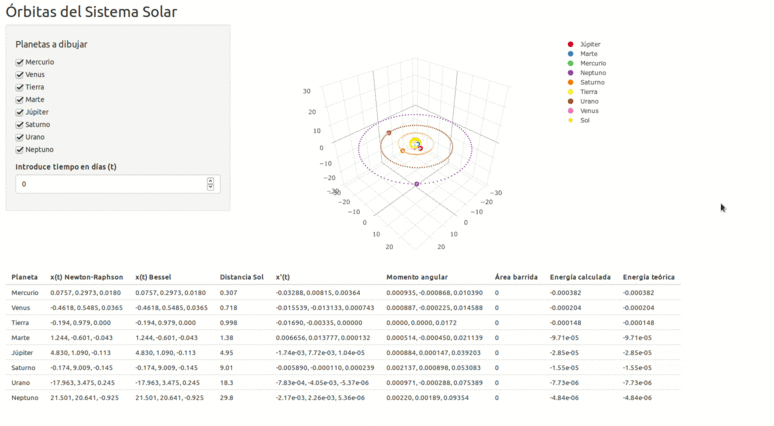

# Planets orbits
Solves implicit equations to calculate position, velocity and trajectories of each Solar System planet, and gives a representation of the orbits

## License
Licensed in GPL3

## Web application
The first assignment, with 2D representation, is accesible [here](https://ncordon.shinyapps.io/planets). 

The second one, with 3D representation [here](https://ncordon.shinyapps.io/planets-v2)

## Local installation
To make a local installation, having `R` installed:

~~~
./install.R
~~~

This script would install all the necesary packages and make the app locally available through `localhost`:

